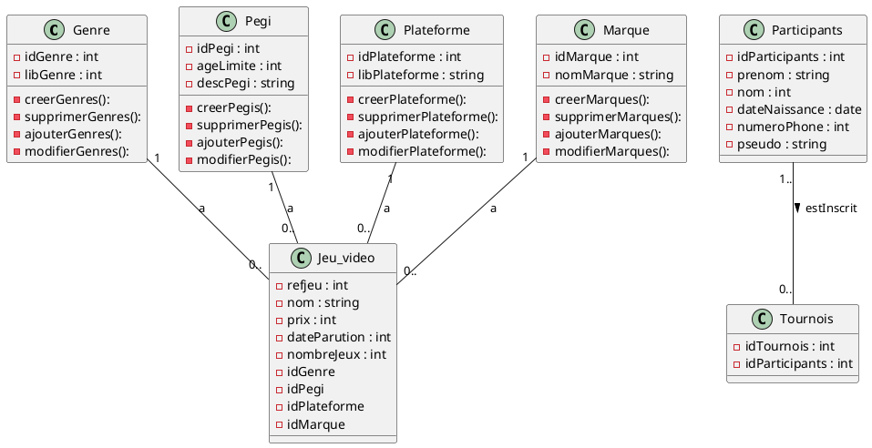
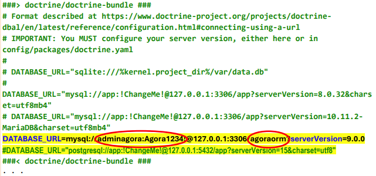
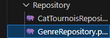

# Compte rendu agora 4 : symfony
Groupe Réda – Célina – Théo – Guenael - Mathieu

# Contexte 

La MJC AGORA de Libreville est une association d’éducation populaire de type loi 1901 qui a pour but de favoriser l’épanouissement de la personne par l’accès à l’éducation et à la culture pour tous. La MJC AGORA symbolise ce carrefour où convergent l’expression artistique, le numérique la musique, les danses, le bien-être et les sports ainsi que de nombreuses autres découvertes culturelles. Elle adapte ses projets aux attentes d’une société en constante évolution. Favoriser les démarches de projets jeunes, renforcer le vivre ensemble et les liens intergénérationnels sont des valeurs chères pour cette association. La MJC AGORA possède l’accréditation Service Volontaire Européen, les agréments jeunesse et sport, et est affiliée à la FFMJC (Fédération Française des Maisons des Jeunes et de la Culture), FRMJC(Fédération Régionale des Maisons des Jeunes et de la Culture), FFE (Fédération Française des Echecs) et à la FFRS (Fédération Française de Roller & Skateboard)

# Objectifs du projets et finalité 
La MJC Agora souhaite procéder à une refonte complète de son site web, poursuivant un double objectif : Un site web front-office destiné au grand public Une application back-office dédiée à l’administration du site Priorité au développement back-office Étant donné que le contenu affiché sur le site public sera intégralement géré via l’interface d’administration, le développement de l’application back-office AgoraBo constitue la première phase du projet. Cette application permettra d’administrer l’ensemble des informations relatives aux activités culturelles, artistiques et sportives, ainsi qu’aux intervenants et membres de la MJC. Elle devra notamment inclure : Les opérations CRUD Des fonctionnalités de recherche simples et efficaces Calendrier de réalisation Le développement du site web public Agora interviendra dans un deuxième temps, une fois le back-office AgoraBo mis en service.

# Trello

# Repo github
https://github.com/masdonte/agora

# Diagramme de classe

# Technologies utilisés

PHP : Langage serveur utilisé pour la logique applicative, avec PDO (PHP Data Objects) pour
un accès sécurisé à la base de données MySQL via des requêtes préparées.
Ainsi que le modèle MVC (modèle vue contrôleur) et le tout en programmation orienté objet.

MySQL : Système de gestion de base de données relationnelle permettant de stocker les différentes entités (genres, plateformes, marques, etc.).

HTML/CSS : Technologies dédiées à la structure et au style des pages. L'application s'appuie sur une charte graphique définie l'aide d'un template Bootstrap (Dashio de TemplateMag),
framework CSS open source sous licence MIT.

JavaScript/ Utilisés pour l'interactivité côté client (animations, gestion dynamique des
formulaires), principalement via les composants du framework Bootstrap

Twig est un moteur de template qui a été créé par SensioLabs, les créateurs du framework
Symfony.
On le retrouve nativement dans les frameworks Symfony et Drupal8, mais il peut être installé
sur la majorité des frameworks ainsi que dans un environnement PHP.

Symfony est un ensemble de composants PHP ainsi qu'un framework MVC libre écrit en PHP.
Il fournit des fonctionnalités modulables et adaptables qui permettent de faciliter et d’accélérer
le développement d'un site web.

# Mission 1 
Afin de passer totalement le projet sous Symfony, nous avons utilisé le composant Doctrine, qui est un logiciel d'ORM.

On a du l'installer avec composer graçe à cette commande dans le terminal du projet : 
composer require symfony/orm-pack

Nous avons ensuite créer une base de donnée à travers doctrine dans le php graçe à cette commande : 
php bin/console doctrine:data:create
Avec cet commande, une nouvelle base de donnée est creer dans la doctrine à travers symfony.

Il a fallut ensuite reconfigurer le .env et remplacer la database_url : 

On peut donc constater que nous avons rajouter le nom de la base de donnée qui est agoraorm et le mot de passe et l'identifiant pour accéder à la base de donnée.

Il a fallut créer les entités dans la base de donnée directement dans le terminal du projet dans le php. Pour créer une entité il faut utiliser cet commande là : 
php/bin/console make:entity 

 ensuite nous donnant le nom de l'entité, avec ses spécifications ( le nom de la table, le type...)
 
 Suite à cela, symfony va générer le fichier suivant : 
 src/Repository/GenreRepository.php 
 

 la doctrine ajoutera automatiquement dans la base de donnée l'entité avec sa table et ses spécifications mais il faut faire une commande pour que cela soi pousser.

Il faut ensuite lancer la migration :
php bin/console make:migration 
Qui sert à pousser vers les entités créer dans la base de donnée. Qui créer un fichier migration.

Il faut refaire une nouvelle commande de migration pour etre sur que cela est bien pousser dans la base de donnée : 
php bin/console doctrine:migrations:migrate

